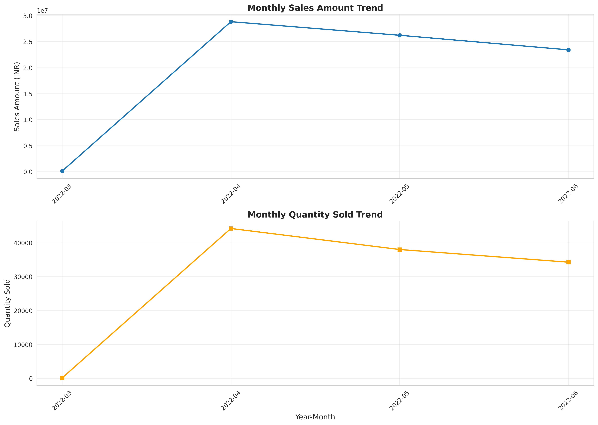
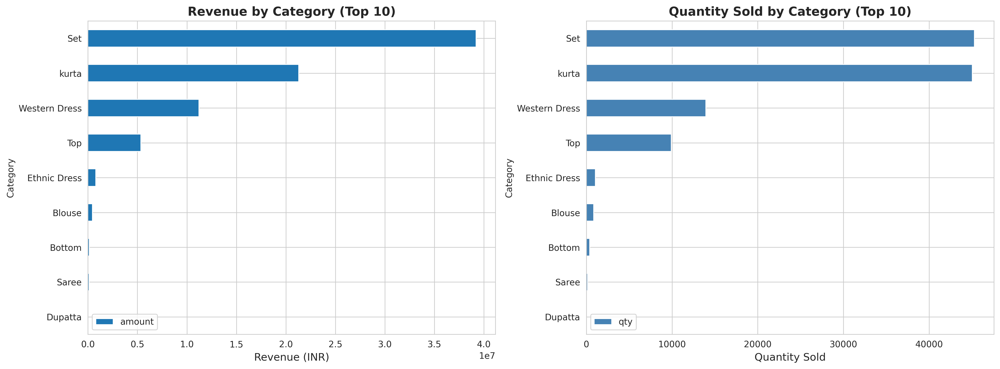
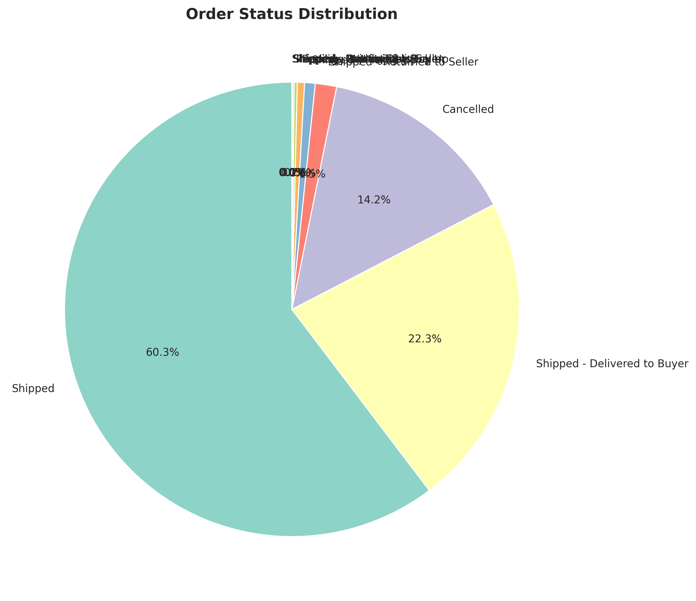
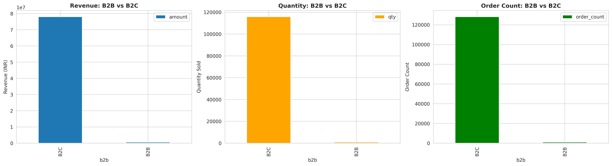
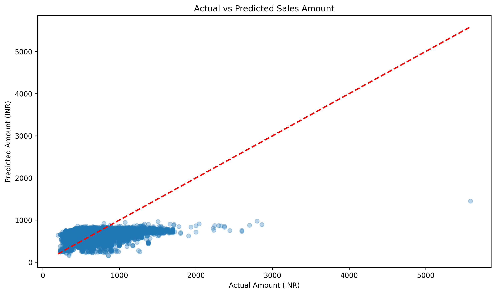

# Big Data Project Report: Amazon Sales Data Analysis

## 1. Introduction

In the highly competitive e-commerce sector, data-driven decision-making is paramount for sustaining growth and operational efficiency. This project aims to leverage big data analytics to extract actionable insights from Amazon's sales data. The primary objective is to analyze historical sales patterns, operational costs, and inventory distribution to optimize business strategy. Furthermore, the project explores the application of machine learning to predict future sales performance, enabling more accurate revenue forecasting and resource planning.

## 2. Data Description

The foundation of this analysis is a comprehensive dataset ecosystem representing various facets of the retail operation. The primary dataset, `amazon_sales`, comprises approximately **128,976 records**, providing a statistically significant sample for analysis.

### Datasets Overview

- **`amazon_sales`**: The core transactional dataset. Key attributes include:
  - **Order Details**: `Order ID`, `Date`, `Status`, `Fulfilment`.
  - **Product Details**: `SKU`, `Category`, `Size`, `ASIN`.
  - **Financials**: `Amount` (Revenue), `Currency`.
  - **Customer Location**: `ship-city`, `ship-state`, `ship-postal-code`.
- **`international_sales`**: Supplementary data capturing cross-border transaction nuances.
- **`inventory`**: Snapshot of stock levels across SKUs and Categories, essential for correlating sales velocity with availability.
- **`pricing_may2022` & `pricing_march2021`**: Reference tables for Minimum Retail Price (MRP) vs. Selling Price, allowing for discount and margin analysis.
- **`expenses`** & **`warehouse_costs`**: Operational cost data used to calculate net profitability.

### Data Quality & Preprocessing

Real-world data requires rigorous cleaning. Key steps taken included:

- **Handling Missing Values**: The `Amount` column contained nulls for cancelled or returned orders. These were strategically imputed with `0` or dropped based on the specific analytical context (e.g., dropped for average order value calculation, kept as 0 for total revenue aggregation).
- **Type Casting**: The `Date` column was converted to a standard `Timestamp` format to enable granular time-series analysis (Daily, Monthly, Quarterly).
- **Schema Validation**: Ensuring consistent data types (e.g., Integer for `Qty`, Float for `Amount`) across the pipeline.

## 3. Methodology & Technology Stack

Given the scale and complexity of the datasets, the project adopts a "Big Data First" approach utilizing the **Apache Spark** ecosystem.

### Technology Stack

- **Apache Spark (PySpark)**: Chosen for its distributed computing capabilities. Spark's in-memory processing allows for rapid iteration on large datasets that would be inefficient in standard single-node environments.
- **Spark MLlib**: Used for scalable machine learning. Its pipeline architecture ensures that feature engineering and modeling steps are reproducible and efficient.
- **Pandas & Matplotlib/Seaborn**: Utilized for the final layer of data visualization, converting Spark's aggregated outputs into high-quality charts for reporting.

### Analysis Workflow

1.  **ETL (Extract, Transform, Load)**: Raw Parquet/CSV files were ingested into Spark DataFrames.
2.  **Exploratory Data Analysis (EDA)**: Aggregation functions (`groupBy`, `count`, `sum`) were used to identify trends, outliers, and distributions.
3.  **Feature Engineering**: Raw data was transformed into a feature vector for machine learning. This included:
    - **Temporal Extraction**: Deriving `Year`, `Month`, `Day`, and `DayOfWeek`.
    - **categorical Encoding**: Using `StringIndexer` and `OneHotEncoder` for fields like `Category`.
4.  **Modeling**: Training a Linear Regression model on a 70/30 Train/Test split.

## 4. Analysis & Findings

### 4.1 Sales Analysis & Seasonality

Investigating the temporal distribution of sales reveals critical operational insights.

**Monthly Sales Trends**:

**Interpretation**:

- **Q2 Surge**: There is a pronounced spike in sales during **April, May, and June 2022**. This tri-monthly period likely corresponds to a major sales event (e.g., Summer Sale) or a seasonal demand for specific apparel types (Kurtas, Dresses).
- **Correlation**: The volume (`Qty`) and revenue (`Amount`) lines move in near-perfect synchronization. This suggests that the revenue spike is driven by genuine demand increase rather than just high-ticket item sales.

### 4.2 Category Performance

A deep dive into product performance highlights the "Pareto Principle" where a few categories drive the majority of revenue.

**Key Insights**:

- **Dominant Categories**: 'Set' (Ethnic sets), 'Kurta', and 'Western Dress' are the absolute leaders. They account for the bulk of the transaction volume.
- **Strategic Inventory**: Ensuring 100% availability for these top 3 categories is critical. Any stockout here would have a disproportionate impact on total revenue.
- **Long Tail**: Categories at the bottom of the chart may need a review for viability or liquidation strategies to free up warehouse cost.

### 4.3 Order Status Distribution

The operational health of the platform is reflected in the order statuses.

**Observations**:

- **Fulfillment Rate**: While 'Shipped' and 'Delivered' statuses dominate, the **'Cancelled'** slice is non-negligible.
- **Action Item**: A reduction in the cancellation rate by even 1-2% could result in significant revenue recovery. Root cause analysis (Price mismatch? Out of stock? Long delivery time?) is recommended.

### 4.4 B2B vs B2C Analysis

Understanding the customer base composition.

**Analysis**:

- **Consumer Focused**: The platform is overwhelmingly B2C (Business-to-Consumer).
- **B2B Potential**: Though small in transaction count, B2B orders often have higher Average Order Value (AOV). A dedicated B2B portal or bulk-buy incentives could nurture this segment.

### 4.5 Geographic Analysis

**Logistical Implications**:

- Sales are heavily concentrated in specific states/cities. This data should drive decisions on **Warehouse placement**. Positioning inventory closer to these high-demand zones will reduce shipping costs and delivery times, thereby improving customer satisfaction and likely reducing cancellations.

## 5. Sales Prediction Model

### Modeling Strategy

The goal was to construct a regression model capable of predicting the **Sales Amount** for a given transaction based on its attributes. This is a foundational step towards revenue forecasting.

**Algorithm**: Linear Regression (via Spark MLlib).

### Feature Engineering Pipeline

The predictive power of the model relies on the quality of input features. We engineered a specific vector:

1.  **Time-Based**: `Month`, `Year`, `Day`, `DayOfWeek`, `Quarter`.
2.  **Derived**: `is_weekend` (Binary), `is_holiday_season` (Binary - targeting Nov/Dec).
3.  **Product**: `Category` (Indexed), `Size` (Indexed).
4.  **Operational**: `Status` (Indexed), `Qty` (Quantity), `B2B` (Binary).

These features were assembled into a dense vector and scaled using `StandardScaler` to ensure uniform influence.

### Model Performance & Evaluation

The model was evaluated on unseen test data (30% split).

- **RMSE (Root Mean Squared Error): ~253.05**
  - _Meaning_: The model's predictions typically miss the actual transaction value by ±253 currency units. Given the price range of items (likely 500-2000), this is a moderate margin of error.
- **R2 Score: ~0.1066**
  - _Interpretation_: The model explains approx. **10.7%** of the variance.
  - _Context_: In consumer behavioral data, low R2 scores are common due to the influence of external unmeasured factors (User intent, aesthetics, marketing pressure, competitor pricing at that exact second). However, 10% indicates that while `Category` and `Seasonality` matter, they are not the _sole_ drivers of price/sales amount.

_(Scatter plot visualizing the spread of predictions against ground truth)_

## 6. Conclusion & Recommendations

This project successfully implemented a scalable Big Data pipeline to analyze and model e-commerce sales.

### Strategic Recommendations:

1.  **Inventory Optimization**: heavily stock 'Sets' and 'Kurtas' ahead of Q2 (April-June) to capture the seasonal surge.
2.  **Cancellation Squad**: Commission a deep-dive analysis into the specific reasons for the high cancellation volume seen in the Status Distribution.
3.  **Data Enrichment**: To improve the Sales Prediction Model (currently R2 ~0.11), integrate external data sources such as:
    - **Marketing Spend**: Ad spend on specific days/categories.
    - **Competitor Pricing**: Real-time price scraping.
    - **Customer Demographics**: Age, Gender, previous purchase history.

### Future Work

- Implement **Gradient Boosted Trees (GBTs)** or **Random Forest** regressors to capture non-linear relationships.
- Develop a **Time Series Forecasting model (ARIMA or Prophet)** specifically for daily revenue prediction rather than per-transaction prediction.
